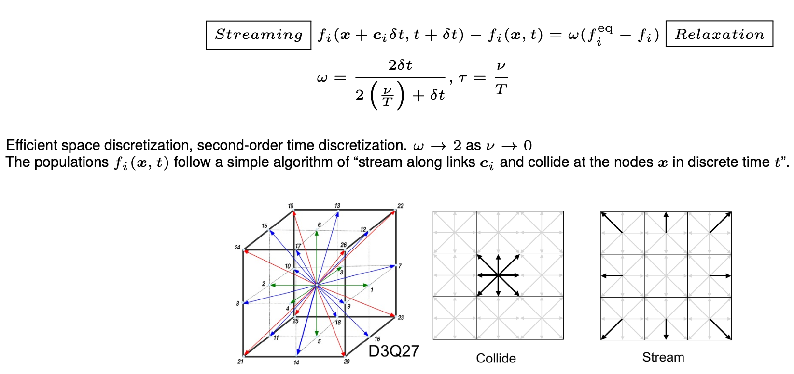
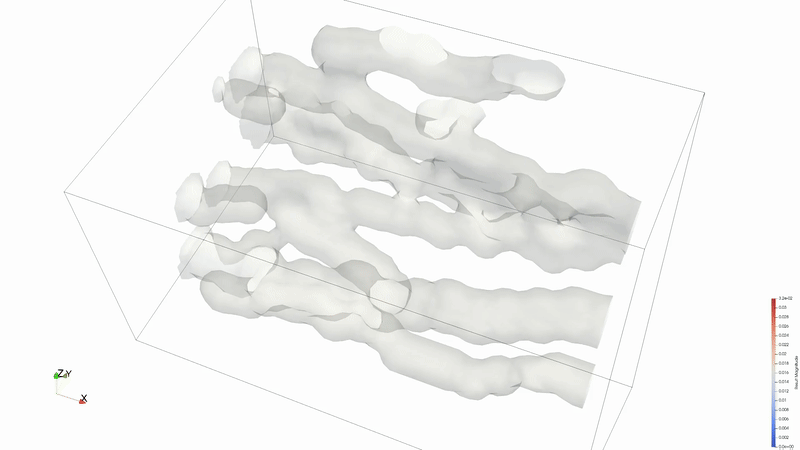

# Lattice Boltzmann Method based CFD Applications: M-Star and MARBLES
<!---
**Documentation:** [ link to documentation](https://nrel.gov)
-->


The Lattice Boltzmann Method (LBM) is a novel and unique simulation method whose meshless algorithm and exact conservation combines the best parts of the immersed boundary method and the finite volume method, without the hassle of mesh generation. The method completely does away with spatial discretisation in favour of advection of particles with pre-determined discrete velocities such that they hop to lattice sites on a structured grid. The LBM has been successfully applied to a range of problems in fluid dynamics including but not limited to transitional flows, flows involving complex moving geometries, compressible flows, multiphase flows, rarefied gases, combustion, electrochemical devices etc.. 

Its meshfree nature makes it very convenient to handle and resolve complex geometries such as cracks and porous microstructures. The algorithmically simple nature of the LBM, which consists of a hopping of particles by a pre-determined distance followed by a local update for a time increment, makes the solver trivial to implement on a GPU, which results into very fast and scalable solvers that can be used as data generators in a machine learning pipeline. 




The method computes a discrete version of the Boltzmann transport equation, which mathematically describes the state of the fluid with a Gaussian distribution in the velocity space with its mean representing the local fluid velocity and the variance representing the local energy of the fluid. The dynamics of the fluid then evolve with a streaming-relaxation equation for these probability distribution functions. The probablistic nature of the method makes it a gateway to [quantum computing for CFD](https://blogs.nvidia.com/blog/ansys-dcai-quantum-computing/). 


## Overview

At NREL, two packages are available for the purpose. The matrix below provides a birds eye view of the available packages. (All company, product and service names used on this page are for identification purposes only. Use of these names, trademarks and brands does not imply endorsement.)

|                                                                              | Windows| Mac OS  | Linux (HPC) | CPU    | GPU    | Cost | Speciality                   |
|:----------------------------------------------------------------------------:|:------:|:-------:|:-----------:|:------:|:------:|:----:|:----------------------------:|
| [M-Star](https://mstarcfd.com/)                                              | y      | x       | y           | y      | y      | $    | GUI, moving geometries       |
| [NREL MARBLES](https://nrel.github.io/marbles/VandV.html)                         | y      | y       | y           | y      | y      | Free | Open source, compressible  |  

Both M-Star and Multi-Scale Adaptively Refined Boltzmann Lattice Solver (MARBLES) can utilize the parallel computing capability of the Kestrel HPC system . 

## Installation and Usage on Kestrel

### NREL MARBLES

The MARBLES [source code](https://github.com/NREL/marbles) is available on Github. It can be compiled and run on NVIDIA and AMD GPUs as well as Intel, AMD and Apple M series CPUs. Here, we show the process to compile and run it on the Kestrel HPC system with NVIDIA GPUs.

Create a new directory in the `projects` partition
```
$ cd /projects/<projectname>/<username>/
$ mkdir marblesLBM
```

Get the `amrex` dependency and set the environment variable `AMREX_HOME`
```
$ cd /projects/<projectname>/<username>/marblesLBM
$ git clone https://github.com/AMReX-Codes/amrex.git
$ cd amrex
$ git checkout 25.11
$ cd ..
$ echo "export AMREX_HOME=/projects/<projectname>/<username>/marblesLBM/amrex" >> ~/.bash_profile
$ bash
```

Get the stable and development version of MARBLES
```
$ cd /projects/<projectname>/<username>/marblesLBM
$ git clone https://github.com/NREL/marbles.git
$ git clone https://github.com/nileshsawant/marblesThermal
```

To install the latest development version of MARBLES, the code has to be built on a GPU login node. Please do the following:
```
$ ssh -X <username>@kestrel-gpu.hpc.nrel.gov
$ module load PrgEnv-gnu/8.5.0
$ module load cuda/12.3
$ module load craype-x86-milan
$ cd /projects/<projectname>/<username>/marblesLBM/marblesThermal
$ cd Build
$ make
$ make USE_CUDA=TRUE
$ ls -tr
GNUmakefile  cmake.sh  tmp_build_dir  marbles3d.gnu.x86-milan.TPROF.MPI.ex  marbles3d.gnu.TPROF.MPI.CUDA.ex
```
If the commands succeed, the `Build` directory should contain the MPI version `marbles3d.gnu.x86-milan.TPROF.MPI.ex` and the MPI + CUDA version `marbles3d.gnu.TPROF.MPI.CUDA.ex` of MARBLES. 

The test case for flow through fractures with heated isothermal walls can be tried out as follows:
```
$ salloc -A <allocation handle> -t 00:30:00 --nodes=1 --ntasks-per-node=32 --mem=80G --gres=gpu:1 --partition=debug
$ module load cuda/12.3
$ cd /projects/<projectname>/<username>/marblesLBM/marblesThermal/Build
$ cp ../Tests/test_files/isothermal_cracks/* .
# Test CPU version 
$ srun -n 4 marbles3d.gnu.x86-milan.TPROF.MPI.ex isothermal_cracks.inp
# Test GPU version
$ srun -n 1 marbles3d.gnu.TPROF.MPI.CUDA.ex isothermal_cracks.inp
```

Results can be viewed in [ParaView](../Viz_Analytics/paraview.md) or [VisIT](../Viz_Analytics/visit/visit.md).


*Animation credit: [@eyoung55](https://github.com/eyoung55)*

[MARBLES](https://nrel.github.io/marbles/VandV.html) is an in-house effort to make a free Lattice Boltzmann solver available to the community. We encourage users to contact us for help setting up your problem or to request additional features. Please visit the repository and create a [New issue](https://github.com/NREL/marbles/issues) or [email](mailto:nsawant@nrel.gov) us directly. A [machine learning framework](https://github.com/nileshsawant/mlForLBM) for using MARBLES in the loop as a data generator has also been created. Pre-built executibles, `marbles3d.gnu.x86-milan.TPROF.MPI.ex` and `marbles3d.gnu.TPROF.MPI.CUDA.ex`, can also be made available on request.

### M-Star

!!! Warning
	Please close the application when not actively using it. The license of this product allows only one user at a time.

The M-Star GUI can be accessed though a [FastX virtual desktop](../Viz_Analytics/virtualgl_fastx.md). M-Star is a resource intensive application whose backend uses Cuda aware OpenMPI to utilize multiple GPUs for computation. The application should always be run on a dedicated compute node while you can interact with the GUI through a FastX session. The steps to use M-Star are as follows:

1. Open a terminal in a FastX session and ask for an [allocation](../Slurm/interactive_jobs.md). For example,
```
$ salloc -A <projectname> -t 01:00:00 --nodes=1 --ntasks-per-node=64 --mem=160G --gres=gpu:2 --partition=debug
```
2. Wait until you obtain an allocation. The terminal will display `<username>@<nodename>` when successful.
3. Open a new terminal tab by right clicking on empty in the terminal. In the new terminal tab, execute the following to connect to the node you have been allocated.
```
$ ssh -X <nodename>
```
4. You are now on a compute node with [X forwarding](https://en.wikipedia.org/wiki/X_Window_System) to a FastX desktop session, ready to run GUI applications. To run M-Star, execute the following in this new terminal tab:
```
$ module load mstar
$ mstar
```

The above process will let you use utilize 64 cores, 160 GB of RAM and 2 GPUs for 1 hour, as requested in the `salloc` command above.
Users can try examples [tutorials](https://docs.mstarcfd.com/1a_Tutorials/index.html) from the offical documentation. The [Simple Agitated Tank example](https://docs.mstarcfd.com/1a_Tutorials/simple-agitated-tank.html) which is relevant to bioreactors has been tested successfully on Kestrel. 


